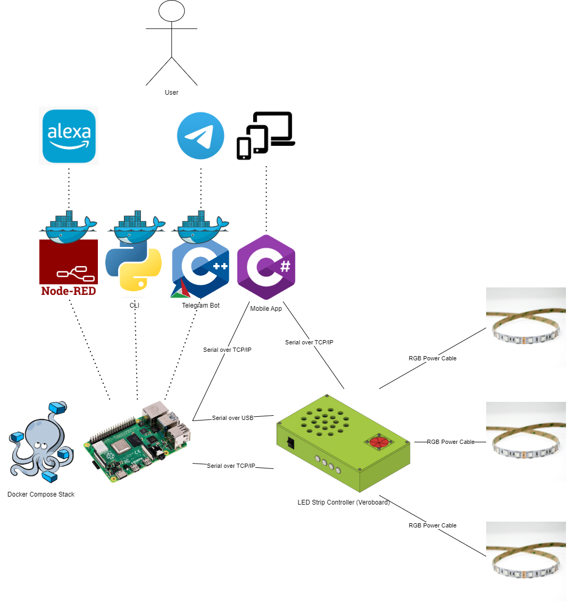

# LED Strip Controller Firmware
[](https://www.gnu.org/licenses/gpl-3.0) [](https://github.com/ScottGibb/LED-Strip-Controller-Firmware/actions/workflows/Build.yaml)
<center>

</center>

## Summary

This repository contains all the firmware to control the LED Strip Controller Hardware variations. The firmware is written in C++ using the Arduino framework, originally I wanted to use the STM32 HAL Drivers, however, the STM32 Microcontrollers were cloned and this resulted in the Arduino framework being used. The firmware is designed to be as flexible as possible, whilst maintaining an easy-to-use interface. The firmware is designed to be used with the LED Strip Controller Software Applications that are described below. The firmware is designed to be used with different microcontrollers.

## System Architecture

As for the system architecture it's designed to be interacted with via a byte stream sent over an interface. At present there is a UART interface over USB. However, there are plans to utilize an IP interface over WiFi. The byte stream is then parsed by the firmware and the appropriate action is taken. The firmware is designed to be as flexible as possible, whilst maintaining an easy-to-use interface. The firmware is designed to be used with the LED Strip Controller Software Applications. The architecture of the full system is shown below:

## Project Structure

This Project uses the PlatformIO Build system and as such adheres to their build structure and folder structure, the project is split into multiple folders outlined as follows:

```
├───docs
├───include
├───lib
│   ├───Board Configurations
│   ├───Buttons
│   ├───Communications
│   ├───Communicators
│   ├───Light Drivers
│   ├───Light Handlers
│   ├───Memory Management
│   ├───Misc Peripherals
│   ├───System Configuration
│   ├───System State Management
│   └───User Mode Handlers
├───src
└───test
```
- docs: holds all diagrams and pictures related to the project
- include: Holds the main header file responsible for the high-level aspects of the project
- lib: contains all private libraries for the project.
- src: contains the main application source code
- test: contains all of the unit tests for the project.
<center>



</center>

## Firmware Design

The firmware is designed to utilize modern C++ principles and be fully object orientated. This was done to allow me to utilize the full power of the C++ language and also allow me to learn new features regarding the language. The class diagram for the firmware is shown below:

<center>

</center>

The firmware is split into multiple layers which follow this layer convention:

<center>

</center>

The idea behind this is that the Arduino layer is abstracted away from the rest of the firmware. This allows the firmware logic to be used across multiple platforms and prevents it from being tied into the Arduino framework.


## Memory Map

The system does require some onboard memory to utilize the User Mode system. This allows the user to create custom colour waveforms and thus create custom effects. The memory map for the STM32F103C8T6 microcontroller is shown below:

<center>

</center>


## Building the Project

This project uses the PlatformIO Build system and as such can be built using the PlatformIO IDE or the PlatformIO CLI. For this simply clone this repository and open the folder using the PlatformIO plugin in VSCode. The IDE should then flag and install all the dependencies based on the platform.ini file.

- [PlatformIO](https://platformio.org/)
- [Visual Studio Code](https://code.visualstudio.com/)
- [PlatformIO Plugin for VSCode](https://marketplace.visualstudio.com/items?itemName=platformio.platformio-ide)

## LED Strip Controller Repository Links

- [Manifest](https://github.com/ScottGibb/LED-Strip-Controller-Manifest) This repository contains the manifest file for the LED Strip Controller project. Which allows the cloning of all the repositories in one go.
- [Hardware](https://github.com/ScottGibb/LED-Strip-Controller-Hardware) This repository contains the hardware design files for the LED Strip Controller project.
- [Firmware](https://github.com/ScottGibb/LED-Strip-Controller-Firmware) This repository contains the firmware for the LED Strip Controller project.
- [Software](https://github.com/ScottGibb/LED-Strip-Controller-Software) This repository contains the software for the LED Strip Controller project.

